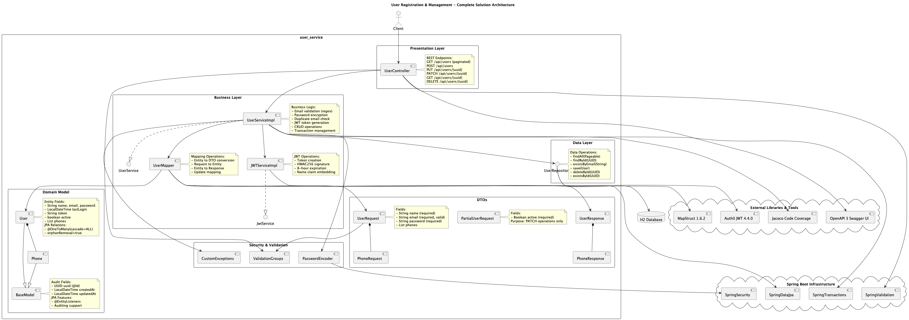

# User Service

El proyecto **User Service** fue desarrollado con **Java 21, Spring Boot 3.5.5, Hibernate, H2 database, Docker,
OpenAPI (Swagger), JUnit5, Jacoco, Karate y Gatling**.  
Se aplicaron prácticas de **TDD, Clean Code y principios SOLID**.

Este microservicio permite registrar usuarios junto con una lista de teléfonos.  
En el registro se generan **tokens JWT**, se validan el **email** y la **password** con expresiones regulares, y se
exponen **endpoints CRUD** para la entidad `User`.

---

## 🛠 Tecnologías

- **Java 21**
- **Spring Boot 3.5.5**
- **Spring Data JPA (Hibernate)**
- **Spring Security**
- **H2 Database (en memoria)**
- **Docker**
- **OpenAPI / Swagger UI**
- **JUnit 5 & Jacoco** (unit testing + cobertura)
- **Karate** (tests end-to-end de la API REST)
- **Gatling** (pruebas de carga y rendimiento)

---

## 🚀 Cómo ejecutar

1. Clonar el repositorio:
   ```bash
   git clone https://github.com/LeandriT/prime_it.git
   cd prime_it
   ```
2. Construir y correr con Gradle:
   ```bash
   ./gradlew clean build
   ./gradlew bootRun
   ```
3. Construir la imagen Docker:
   ```bash
   docker build -t user-service .
   docker run -p 8080:8080 user-service
   ```
4. Ejecutar pruebas unitarias + reporte de cobertura:
   ```bash
   ./gradlew test jacocoTestReport jacocoTestCoverageVerification
   ```
   El reporte HTML queda en `build/jacocoHtml/index.html`.
5. Ejecutar pruebas de integración con **Karate**:
   ```bash
   ./gradlew test --tests "*KarateSuiteIT*"
   ```
   El reporte HTML queda en `build/karate-reports/karate-summary.html`.
6. Ejecutar pruebas de rendimiento con **Gatling**:
   ```bash
   ./gradlew clean gatlingRun --all
   ```
   Al finalizar se generan reportes HTML individuales en: `build/reports/gatling/<simulación>/index.html`
7. Acceso a la consola H2:
    - URL: [http://localhost:8080/h2-console](http://localhost:8080/h2-console)
    - JDBC URL: `jdbc:h2:mem:users`
    - Usuario: `sa`
    - Password: *(vacío)*
8. Acceso a la documentación OpenAPI/Swagger:
    - [http://localhost:8080/swagger-ui/index.html](http://localhost:8080/swagger-ui/index.html)

---

## 📑 API Reference

### Listar usuarios (paginado)

```http
GET /api/users?page=0&size=10
```

### Obtener usuario por UUID

```http
GET /api/users/{uuid}
```

### Crear usuario

```http
POST /api/users
Content-Type: application/json
```

**Body ejemplo:**

```json
{
  "name": "Juan Rodriguez",
  "email": "juan@rodriguez.org",
  "password": "Secret123!",
  "phones": [
    {
      "number": "800914773",
      "city_code": "2",
      "country_code": "+56"
    }
  ]
}
```

### Actualizar usuario (PUT)

```http
PUT /api/users/{uuid}
```

### Actualizar parcialmente usuario (PATCH)

```http
PATCH /api/users/{uuid}
```

**Body ejemplo:**

```json
{
  "active": false
}
```

### Eliminar usuario

```http
DELETE /api/users/{uuid}
```

---

## 📦 DTOs principales

- **UserRequest** → datos de entrada para crear/actualizar usuario
- **PartialUserRequest** → datos de entrada para actualización parcial
- **PhoneRequest** → datos de entrada de teléfonos
- **UserResponse** → respuesta de la API
- **PhoneResponse** → respuesta de teléfonos

---

## ✅ Pruebas

- **JUnit 5 + Jacoco** → Pruebas unitarias y verificación de cobertura (>85%).
- **Karate** → Pruebas end-to-end de los endpoints REST (`users.feature`).
    - Validan el flujo completo: **crear → obtener → actualizar → patch → eliminar**.
    - Reportes en `build/karate-reports/`.
- **Gatling** → Pruebas de rendimiento sobre endpoints de usuario (`CreateUserSimulation`, `IndexUserSimulation`,
  `PartialUpdateUserSimulation`).
    - Se ejecutan con `./gradlew clean gatlingRun --all`
    - Reportes en `build/reports/gatling/`.

---

## 🧩 Diagrama de Arquitectura



## ✍️ Autor

- [@GandhyCuasapas](https://github.com/LeandriT)